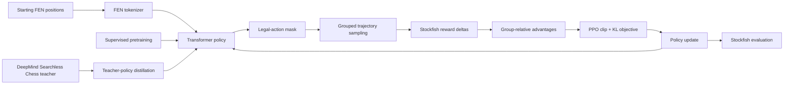

# GRPO Chess

Research engineering project exploring whether chess transformers can improve through GRPO-based self-play.

The project adapts a fixed-action-space, searchless chess policy into a PyTorch training pipeline. It includes supervised pretraining, teacher-policy distillation, on-policy trajectory generation, Stockfish-based rewards, and checkpoint/evaluation tooling. The infrastructure is implemented and tested; whether GRPO reliably improves the policy remains an open experimental question.

## What I Built

The project-owned layer adds:

- An encoder-only `ChessTransformer` policy over the 1,968-action chess move space, with FEN tokenization and legal-action masking.
- A GRPO/PPO-style training loop that samples grouped trajectories, computes per-step Stockfish reward deltas, normalizes advantages across each group, and applies clipped policy updates with a KL penalty.
- Configurable supervised pretraining on high-Elo game positions and soft-label distillation from DeepMind Searchless Chess teacher checkpoints.
- Stockfish process management, randomized-opening evaluation, checkpoint conversion/compatibility checks, and W&B/CSV experiment logging.
- Tests for GRPO invariants, numerical stability, legal moves, dataset behavior, checkpoint loading, Stockfish integration, and training smoke paths.

The upstream relationship is described in [Attribution](#attribution); the model checkpoints and original Searchless Chess implementation are not presented as original work here.

## Current Status / Results

The training and evaluation code is functional enough for smoke tests and research runs. The central research result is not yet a success claim: the committed evidence does not demonstrate that GRPO reliably improves the chess policy.

| Track | Verified evidence | Interpretation |
| --- | --- | --- |
| Teacher baseline | DeepMind 136M: **0.688 score**, **12/20/0 W/D/L**, **+137 approximate Elo** against Stockfish skill 2 over 32 games | Reference baseline only; this is not GRPO performance. [Report](research_docs/2026-02-24_deepmind-136m-teacher-baseline.md) |
| Distillation | A documented weak run reached `val/top1_match=0.049`; its downstream evaluation was **0.015625**, **0/2/62 W/D/L** against Stockfish skill 2 | The converted-label path produced near-singleton targets and weak student quality. [Analysis](research_docs/2026-02-20_distill-grpo-collapse-analysis.md) |
| GRPO | The best older documented run reached **0.047 score**, **0/3/29 W/D/L**, **-523 approximate Elo**; later warm-start evidence reached **0/2/62** | These are weak/failed outcomes, not evidence of reliable improvement. [Analysis](research_docs/2026-01-14_per-step-rewards-analysis.md) |

The most useful result so far is methodological: the repository records entropy collapse, weak reward signal, temperature mismatch, sparse distillation labels, and infrastructure failures as dated analyses rather than hiding them. See [research notes](research_docs/README.md).

## System Architecture



The GRPO path samples multiple trajectories per starting position. Each valid step records the selected action, old-policy log-probability, legal-action mask, and Stockfish-based reward delta. The loss standardizes rewards across the trajectory-group dimension, then applies the PPO clipped surrogate and KL penalty. Pretraining and distillation are separate initialization paths for the same policy family.

## Technical Highlights

- Legal-action masking is applied before policy sampling and loss evaluation.
- Group-relative, per-step advantage normalization handles padding and avoids a learned value head in the main GRPO path.
- Importance ratios are computed from log-probabilities with finite-value and overflow guards.
- PPO clip fraction, ratio, KL, entropy proxy, reward statistics, trajectory length, and teacher-forcing fraction are logged for failure diagnosis.
- Stockfish engines are managed through named processes and cached reward evaluations.
- Checkpoint loaders handle raw state dictionaries and Lightning checkpoints, with compatibility checks for known formats.
- YAML configuration is converted into typed dataclasses so training, evaluation, model, policy, and dataset settings remain configurable.

## Evaluation

The evaluation harness plays the policy against Stockfish and reports wins, draws, losses, score, termination reasons, and an approximate Elo difference. The score is `(wins + 0.5 * draws) / games`. The documented teacher baseline uses Stockfish skill 2, a 50 ms move limit, 32 games, alternating colors, and randomized six-ply openings. GRPO defaults use 64 games; other configs use 32 or 4 games for smoke tests.

The reported Elo is a logistic transform of match score, not a calibrated rating. Small game counts, randomized openings, time-limited Stockfish, and changing configurations make historical scores noisy and unsuitable for claiming a stable ranking. The research reports discuss these limitations and do not provide a controlled multi-seed ablation table.

## Code Tour

- [GRPO training module](src/grpo_logic/model.py) — Lightning orchestration, grouped rollouts, reward logging, and PPO updates.
- [GRPO/PPO objective](src/grpo_logic/loss.py) — advantage normalization, clipping, KL penalty, and diagnostics.
- [Trajectory sampler](src/grpo_logic/sampling.py) — batched policy trajectories, legal moves, reward deltas, and optional teacher forcing.
- [Policy architecture](src/models.py) — token embeddings, transformer encoder, policy head, and legal-action probabilities.
- [Stockfish rewards](src/chess/rewards.py) — normalized and cached reward calculations.
- [Evaluation harness](src/evaluator.py) — policy-vs-Stockfish games and Lightning evaluation callback.
- [Distillation module](src/distill/distill.py) — soft-label objective, diagnostics, and checkpoint export.
- [GRPO tests](tests/grpo/test_group_advantage_invariants.py) — mathematical and padding invariants for the learning signal.

## Repository Structure

```text
src/
├── grpo_logic/       # GRPO/PPO loss, rollout sampling, Lightning module
├── chess/            # board encoding, rewards, Stockfish integration
├── distill/          # teacher data, distillation, checkpoint conversion
├── pretrain/         # supervised policy pretraining
├── models.py         # transformer policy
├── models_9m.py      # Searchless Chess 9M-compatible policy path
└── configs/          # YAML experiment configurations
tests/                # unit, integration-style, and smoke tests
research_docs/        # experiment plans, run reports, debugging analyses
searchless_chess/     # DeepMind project submodule
scripts/              # evaluation, conversion, and cloud-job helpers
interview_presentation/ # optional technical presentation and plots
```

## Reproducing

The shortest credible local path is:

```bash
git clone --recurse-submodules https://github.com/noamdwc/grpo_chess.git
cd grpo_chess
python -m venv .venv
source .venv/bin/activate
python -m pip install -r requirements.txt
```

Install Stockfish separately and set `stockfish.path` in the selected YAML config if it is not found automatically.

Run a focused CPU smoke suite:

```bash
python -m pytest tests/grpo tests/test_checkpoint_compat.py tests/test_models_readout.py -q
```

Run the full test suite when Stockfish and the optional data/model dependencies are available:

```bash
python -m pytest tests/ -q
```

Training and teacher evaluation are compute- and data-intensive. Representative commands are:

```bash
python -m src.train_self_play --config default.yaml
python -m src.distill.eval_teacher --config distill.yaml --teacher_model 136M
python -m src.distill.distill --config distill.yaml
```

The DeepMind teacher checkpoints and generated datasets are external artifacts; follow the submodule and experiment-report instructions rather than expecting them in Git.

## Research Notes

[`research_docs/`](research_docs/) contains experiment plans, run reports, failure analyses, debugging notes, and a known-not-implemented list. Negative results are retained because they document what was tested, what failed, and which follow-up experiments are justified.

## Attribution

This project builds on Google DeepMind's [Searchless Chess](https://github.com/google-deepmind/searchless_chess), included as the `searchless_chess` Git submodule. The upstream project supplies the original searchless chess model family, tokenizer/action-space conventions, and teacher checkpoints/data formats. The surrounding PyTorch GRPO, pretraining, distillation, Stockfish reward/evaluation, configuration, compatibility, and test infrastructure lives in this repository. Upstream licensing and attribution remain applicable to the submodule and any derived assets.

## Limitations / Current Work

- No committed experiment establishes a reliable GRPO strength improvement.
- Evaluation is relatively low-sample and time-limited; approximate Elo should be read as a comparison statistic, not a calibrated rating.
- Distillation quality depends strongly on the data-generation path; sparse converted labels caused a documented collapse.
- Full reproduction requires Stockfish, DeepMind checkpoints, external datasets, and — for cloud runs — separate credentials and infrastructure.
- Planned work includes controlled multi-seed evaluation, stronger data-quality gates, and clearer comparisons against supervised controls.

There is no repository-level software license specified at present.
