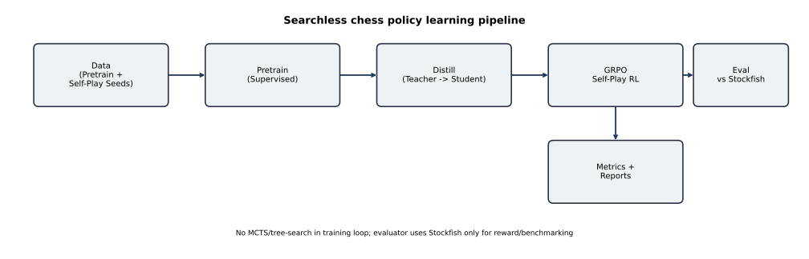
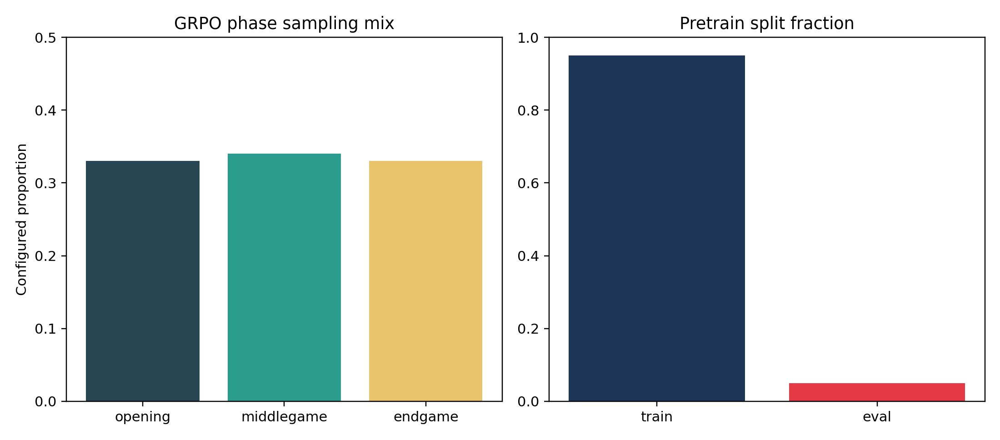
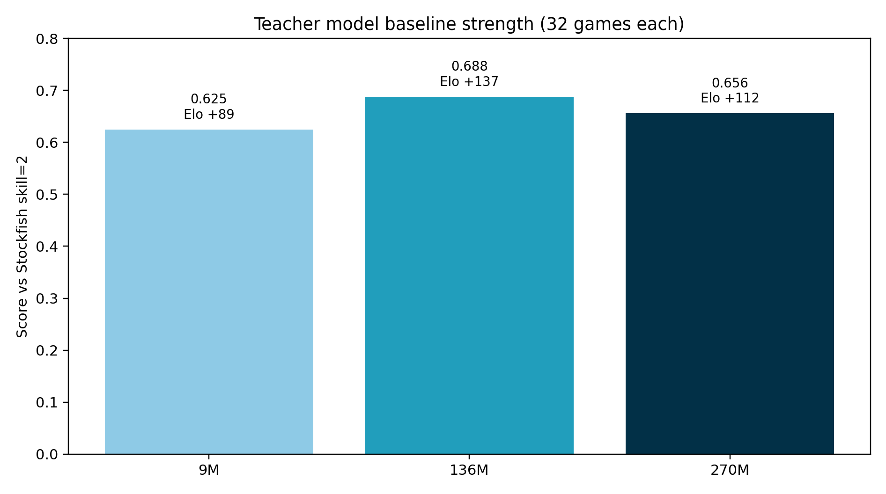
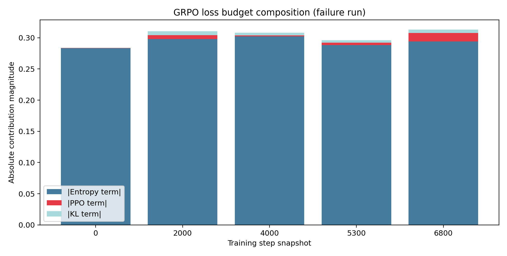
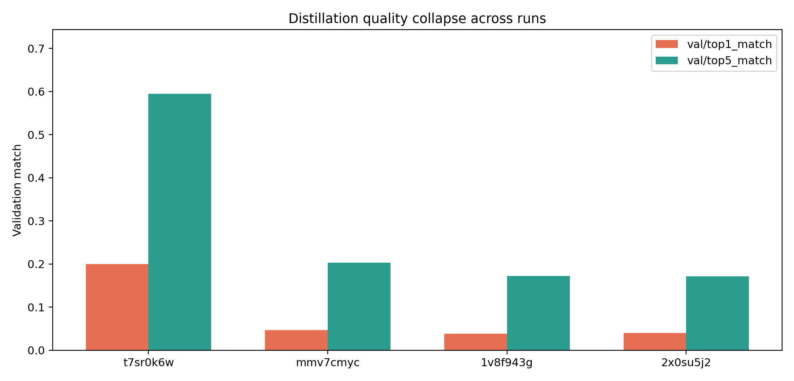
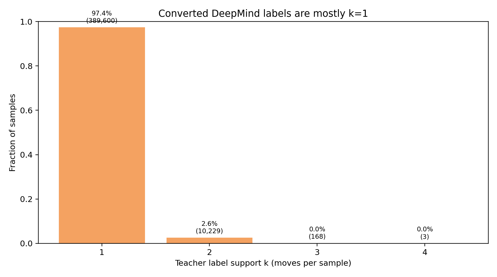

# GRPO Chess
### Searchless policy learning for chess via pretrain + distill + GRPO

**Value proposition:** Train a compact chess policy that improves through self-play without tree search.

---

# The Problem

- Predict strong legal chess moves directly from board state (policy over 1968 actions).
- Target: improve strength against Stockfish while keeping inference simple.
- Why it matters:
  - Searchless inference can be cheaper/simpler to deploy than search-heavy engines.
  - Enables a pure policy-learning research loop (pretrain -> distill -> RL).

---

# Why It Is Hard

- Reward signal is noisy and expensive (Stockfish-based eval during RL).
- Distribution shifts across training stages (supervised data -> teacher labels -> self-play).
- Action space is large (1968), but legal moves per state are sparse.
- Training can fail silently: clip saturation, entropy/regularization imbalance, weak distilled warm-start.

---

# High-Level Solution



- End-to-end chain used in repo: **Pretrain -> Distill -> GRPO -> Eval/Reports**.
- Searchless invariant maintained in policy training.

---

# Data: Sources, Splits, Schema, Scale

| Stage | Source | Scale / Split | Schema (core) |
|---|---|---|---|
| Pretrain | `angeluriot/chess_games` | 14M games (7.3GB), eval fraction 5% | `board_tokens`, `target_action`, `legal_mask` |
| Distill | Generated/converted shards | default up to 2,000,000 samples | `board_tokens`, `legal_mask`, `teacher_action_indices`, `teacher_probs` |
| GRPO | On-the-fly start states | phase mix opening/mid/end = 0.33/0.34/0.33 | sampled trajectories with per-step rewards |



---

# Modeling: Feature Extraction + Policy Model

```text
FEN string
  -> tokenizer -> board token ids
  -> Transformer encoder (embed_dim=256, layers=4, heads=8)
  -> readout (mean/last/cls)
  -> policy head -> logits over 1968 moves
  -> legal-move mask -> sampling / argmax
```

- Same core model family reused across pretrain, distill, and GRPO.
- No MCTS/tree-search in policy training loop.

---

# Training & Eval Design

- GRPO training:
  - sample `G` trajectories per board (`num_trajectories`, `trajectory_depth`)
  - per-step reward from Stockfish eval delta
  - optimize PPO-style clipped loss + KL penalty
- Evaluation:
  - policy vs Stockfish, randomized openings, fixed game budget
  - score = `(wins + 0.5 * draws) / games`
  - reported with approx Elo difference
- Baseline setting used in docs: Stockfish skill 2, 32/64 games depending on config.

---

# Results: Main Metrics

| Result | Value |
|---|---:|
| Teacher 136M vs SF skill 2 | score **0.688**, W/D/L **12/20/0**, Elo **+137** |
| Teacher 9M vs SF skill 2 | score **0.625**, W/D/L **8/24/0**, Elo **+89** |
| GRPO failure run typical score | ~**0.03** |
| GRPO failure run peak score | **0.10** (analyzed as noise) |
| Distill collapse final eval score | **0.015625** |




---

# Error Analysis: What Fails and Patterns

- Distill supervision collapse:
  - converted labels overwhelmingly single-move (`k_mean=1.026`, entropy mean `0.018`)
  - downstream quality drops (`val/top1_match` ~0.04-0.05 in weak runs)
- GRPO dynamics failure:
  - high clip fraction (~0.46-0.52) and weak learning signal
  - loss budget dominated by entropy term in failure analysis doc




> TODO: missing in repo: confusion-matrix-style move error matrix and per-position failure PGN gallery.

---

# Ablations: What Mattered Most

Available evidence from repo analyses:
- Loss-budget analysis suggests entropy/KL weighting dominated gradients in one failed run.
- Temperature-mismatch bug analysis reports step-0 clip fraction at **0.556** before fix.
- Distill data-path split (`quality` vs `fast`) motivated by sparse-label root cause.

What is missing for a full ablation story:
- Controlled multi-run ablation grid with identical seeds/budgets.
- Statistical confidence intervals across repeated runs.

> TODO: missing in repo: consolidated ablation table (same protocol, multiple seeds).

---

# Productionization Plan

- **Serving path:** tokenize FEN -> transformer policy -> legal-mask constrained move selection.
- **Latency/cost controls:** compact model (`embed_dim=256`, 4 layers), configurable eval/teacher forcing budgets.
- **Monitoring:**
  - online: action distribution/entropy, illegal-action guard hits, latency.
  - offline: `eval_stockfish/score`, W/D/L, clip fraction, reward stats.
- **Drift/retraining:**
  - scheduled checkpoint evaluations vs fixed Stockfish protocol.
  - trigger retrain on sustained score drop / distribution shift.
- **Safeguards:** checkpoint quality gates, fallback model, reproducible config+artifact lineage.

---

# Lessons Learned + Next Steps

- Data quality and objective alignment can dominate optimizer tuning.
- Searchless RL is feasible as a pipeline, but fragile without strict diagnostics.
- Most leverage next:
  1. enforce dataset preflight gates (`k_mean`, entropy, legality coverage).
  2. run controlled GRPO ablations after known bug fixes.
  3. harden quality-mode distillation and promote only eval-gated checkpoints.

---

# Appendix: Extra Evidence + Repo Pointers

Extra visual:


Key repo pointers:
- `README.md`
- `src/grpo_logic/model.py`, `src/grpo_logic/loss.py`, `src/grpo_logic/sampling.py`
- `src/pretrain/pretrain_dataset.py`, `src/distill/distill_dataset.py`, `src/chess/boards_dataset.py`
- `research_docs/2026-02-24_deepmind-136m-teacher-baseline.md`
- `research_docs/2026-02-22_distill-quality-collapse-sparse-labels.md`
- `research_docs/2026-02-06_loss-budget-and-monitor-analysis.md`
- `research_docs/2026-02-07_clean-run-temperature-mismatch-bug.md`

